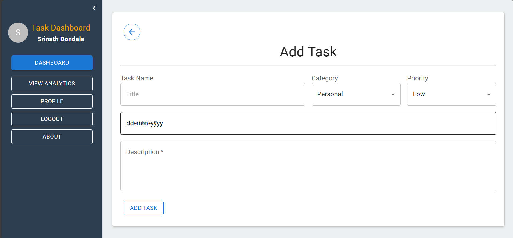

# Task Management Dashboard with Analytics

A comprehensive task management dashboard with Kanban-style boards and integrated analytics. This application tracks task completion rates, user performance, and project progress, offering both admin and user roles with different permissions.

## Features

- **Kanban Board**: Drag-and-drop functionality powered by `react-dnd`.
- **TypeScript Support**: Type-safe definitions for task structures, status enums, and custom hooks.
- **Admin and User Roles**:
  - **Admin**: Can create projects, register users, assign tasks, and track task progress.
  - **User**: Can log in, view and manage assigned tasks, and track their own progress.
- **Analytics Dashboard**: Built with `react-chartjs-2` to display task status insights (completed, ongoing, upcoming).
- **Private and Project-Based Tasks**: Users have access to private tasks and project-based tasks assigned to them.

## Core Concepts

- **Context API**: Manages user data across the application.
- **Enums and Typing**: Type-safe task statuses and chart data structures.
- **Error Handling**: Integrated error handling for smooth and secure task management.

## Installation

1. **Clone the Repository**:
   ```bash
   git clone https://github.com/yourusername/task-management-dashboard.git
   cd task-management-dashboard
2. **Navigate to server**:
    ```bash
    cd server
3. **Install Dependencies**:
    ```bash
    npm install
4. **Start the Server**:
    ```bash
    npm start
5. **Navigate to client in new terminal**:
    ```bash
    cd client
6. **Install Dependencies**:
    ```bash
    npm install
7. **Start the Server**:
    ```bash
    npm run dev

## Screenshots

### Landing Page


### User Pages





## Usage

### Admin Features

- **Create Projects**: Admins can create new projects.
- **Register Users**: Admins can add users to the system.
- **Assign Users to Projects**: Allocate users to specific projects.
- **Create and Assign Tasks**: Create tasks and assign them to users.
- **Track Progress**: Use the dashboard to track task progress.

### User Features

- **Login**: Users log in to access assigned tasks.
- **Manage Tasks**: Users can update the status of their tasks.
- **Private and Project Tasks**: Users have access to their own private tasks and those assigned within projects.

## Built With

- **React**: JavaScript library for building user interfaces.
- **TypeScript**: For static typing of task structures and custom hooks.
- **react-dnd**: Drag-and-drop support for Kanban board.
- **react-chartjs-2**: Charting library for task analytics.
